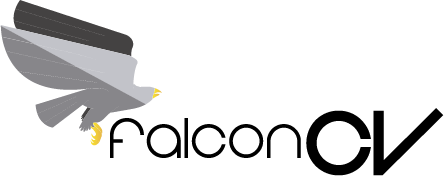

[](https://www.python.org/)

[](https://GitHub.com/haruiz/FalconCV/network/)
[](https://GitHub.com/haruiz/FalconCV/stargazers/)
[](https://GitHub.com/haruiz/FalconCV/watchers/)

# FalconCV

FalconCV is an open-source Python library that offers developers an interface to interact with some of the most popular computer vision frameworks, such as TensorFlow Object detection API and Detectron.

The main objective behind it is to unify the set of tools available and simplify the use of them. This library is focused mainly on Computer Vision practitioners but also is flexible enough to allow researchers to configure the models at a low-level.

Additionally, taking advantage of the fantastic features that OpenVINO offers, a custom model can be trained and optimized to run efficiently in the target hardware with just a few lines of code. It is important to say that FalconCV does not attempt to replace any of the tools mentioned previously; instead, it takes the best of them and offers a solution to improve accessibility to new users.

# Supported frameworks

- [Tensorflow Object Detection API](https://github.com/tensorflow/models/tree/master/research/object_detection).

# Installation

1 - Create and activate a conda environment:

```bash
conda create --name falconcv python=3.6
```
2 - Install dependencies:

```bash
pip install matplotlib
pip install numpy==1.17
pip install opencv-contrib-python
pip install pillow
pip install cython
pip install tqdm
pip install scipy
pip install requests
pip install clint
pip install validators
pip install more-itertools
pip install pandas
pip install imutils
pip install boto3
pip install "dask[complete]"
pip install lxml
pip install Mako
pip install colorlog
pip install colorama
pip install bs4
pip install pick
pip install -U scikit-learn
pip install gitpython
conda install -c anaconda wxpython
```

**Linux:**

```bash
sudo apt install protobuf-compiler
pip install pycocotools
```

**Windows:**

```bash
pip install wmi
pip install windows-curses
pip install pycocotools-win
```

3 - Install backends:

- **TensorFlow:** `conda install tensorflow-gpu==1.15.0`


### Option 1: Install FalconCV from GitHub source

```bash
git clone https://github.com/haruiz/FalconCV
cd FalconCV
python setup.py develop --user
```

### Option 2: Install FalconCV from PyPi (test):

```bash
pip install -i https://test.pypi.org/simple/ falconcv
```

### Option 3: Install FalconCV from github:

```bash
pip install git+https://github.com/haruiz/FalconCV.git
```


# Usage

## Datasets

### OpenImages example

```python
from falconcv.ds import OpenImages

if __name__ == '__main__':
    # Create the dataset
    dataset = OpenImages(v=6) # versions 5 and 6 supported
    dataset.setup(split="train", task="detection")
    images_folder = "<output folder>"
    for batch_images in dataset.fetch(
        n=100, # number of images by class
        labels=["Mouse", "dog"], # target labels
        batch_size=50 # batch images size
        ):
        # Do something cool with the images
        for img in batch_images:
            # export images to disk
            img.export(images_folder)
            for region in img.regions:
                print(region.shape_attributes["x"],
                      region.shape_attributes["y"])
```

## Models

### TensorFlow Object Detection example

**Train a custom model:**

```python
from falconcv.models import ModelBuilder

if __name__ == '__main__':
    config = {
        "model": "<model name from zoo>",
        "images_folder": "<images folder path>",
        "output_folder": "<model output folder>",
        "labels_map": "<labels map as a dict or file>",
    }
    with ModelBuilder.build(config=config) as model:
        model.train(epochs=2000,val_split=0.3,clear_folder=False)
```

For more detailed info visit the [documentation](https://haruiz.github.io/FalconCV/).
Also, you can open the Colab demo:

[](https://colab.research.google.com/drive/1Q_l7RsAFiITJVj8yOMLR0yVNf97T7r43)

# API Documentation

You can found the API documentation at <https://haruiz.github.io/FalconCV/>.

# Roadmap

You can see the detailed [roadmap](https://github.com/haruiz/FalconCV/projects/1) here.

# How to contribute

We are encouraging anyone around the world to contribute to this project. So, we principally need help improving the documentation, translation to other languages (which includes but not limited to French, Spanish, Portuguese, Arabian, and more) or adding new features.
Fork the repository and run the steps from [Install FalconCV from GitHub source](#option-1-install-falconcv-from-github-source). Any questions, do not hesitate to write an email to henryruiz22@gmail.com. We are excited to see where this project goes.

Send a pull request!

# Contributors
<a href="https://github.com/haruiz/FalconCV/graphs/contributors">
  
</a>

# Citation

```commandline
@misc {FalconCV,
    author = "Henry Ruiz, David Lopera",
    title  = "FalconCV, an open-source transfer learning library that offers developers an interface to interact with some of the most popular computer vision frameworks",
    url    = "https://github.com/haruiz/FalconCV",
    month  = "jun",
    year   = "2020--"
}
```
# Credits
- [Speed/accuracy trade-offs for modern convolutional object detectors.](https://arxiv.org/abs/1611.10012)

# License
Free software: [MIT license](LICENSE)
